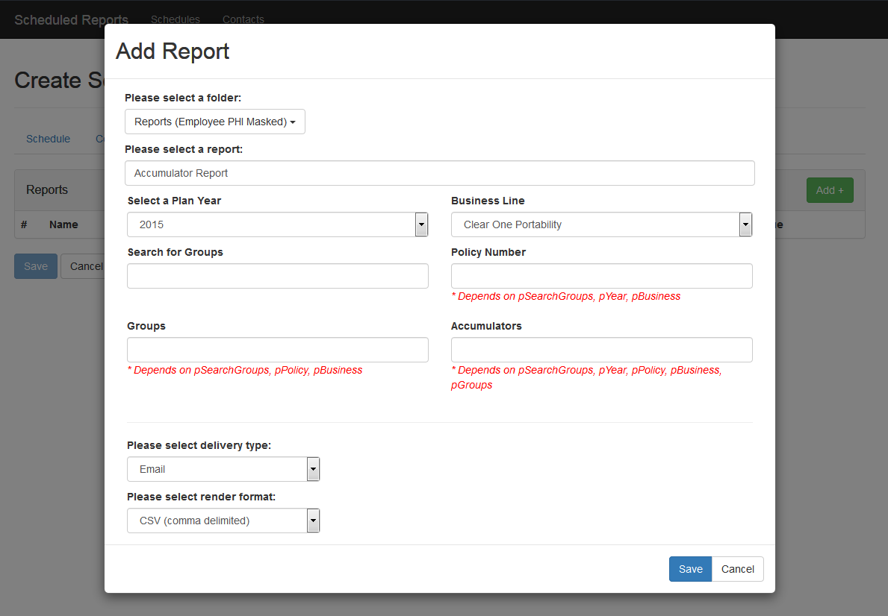
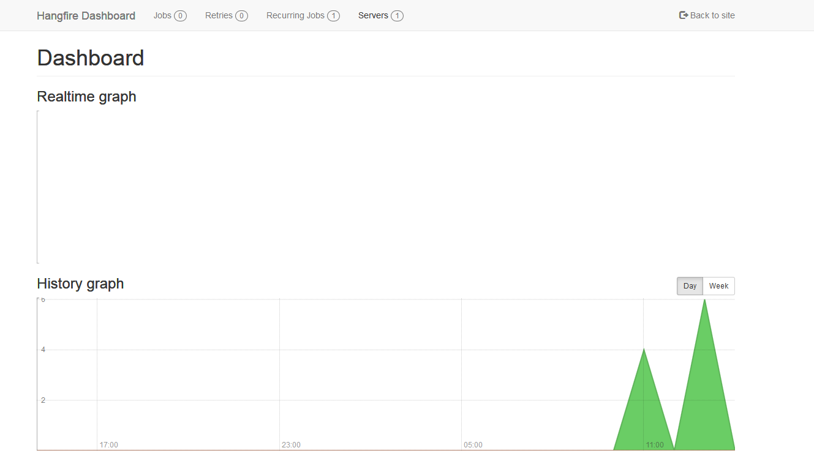
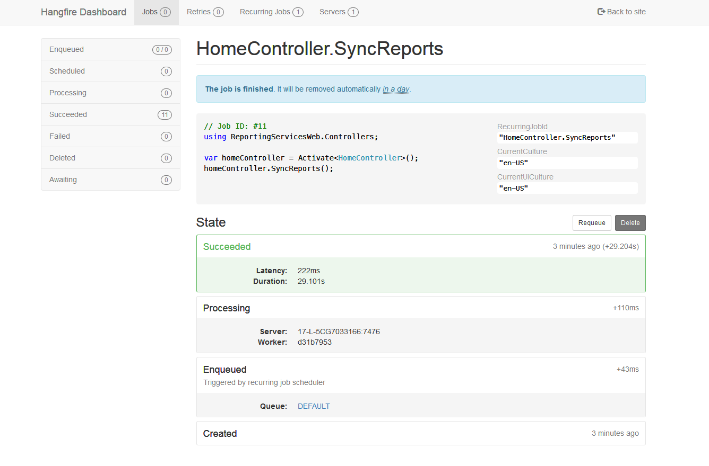

# Changelog - v0.5.1

2018-04-17 Kevin Stine <kevin.stine@pacificsource.com>

## Improvements/New Features

### Report Parameter Dependency Handling

Fully implemented report parameters which depend on other parameters. Instead of just showing a text box for those particular parameters,
we now display some information to the user signifying which parameters are dependent, and what parameters they depend on.



### Initial Implementation of Hangfire

Implemented Hangfire to perform background processing in .NET. This provides a nice interface to view/edit all
scheduled jobs and completely automates the process. This is how to the tool will handle scheduling, by creating
recurring background tasks which will get run.

An example of the Hangfire Dashboard:



Here is an example of the scheduled job details in Hangfire:



___

## Bug Fixes

### Edit Reports

* Fixed an issue that prevented the removal of a report from a schedule without throwing an error

```csharp
// Remove RSDeliverTypes and DeliverTypes that are NOT present when saving
foreach (var param in val.RSDeliverTypes)
{
    db.DeliverTypes.Remove(param.DeliverType);
}
foreach (var param in val.RSDeliverTypes.ToList())
{
    db.RSDeliverTypes.Remove(param);
}
db.ReportSubscriptions.Remove(val);
```

___

Link to QA: <https://administrationqa/ReportScheduling>

Corresponds to Release *30*:
Link to QA: <http://spf-tfs:8080/tfs/IT/base/_release?releaseId=612&_a=release-summary>
Link to release notes: <https://github.com/ikaikastine/SchedulingTool-Changelogs/blob/master/v0.5.1.md>