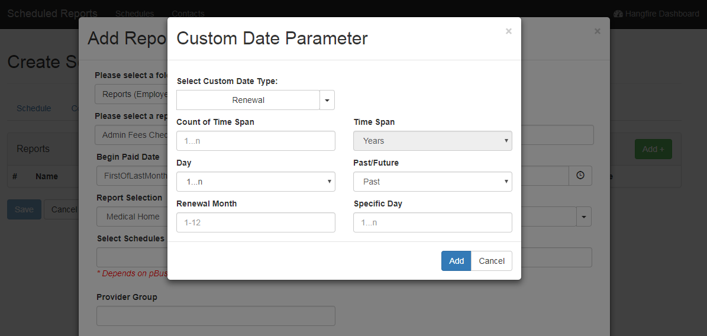

# Changelog - v0.6.0

2018-04-27 Kevin Stine <kevin.stine@pacificsource.com>

## Improvements/New Features

### Custom Date Parameters

Implemented custom date parameters for any parameters which are of type `DateTime`. This includes the addition of a button within the input group
that pops up a new modal overlay which allows the user to specify custom date params to be handled by the controller. This includes Non-Renewal
and Renewal types, with count of time span, time span, day, past/future and specific day and renewal if applicable. Also included some logic to
determine the contraction (st/nd/rd/th) for the specified day if supplied. Included logic which would keep the custom date parameters in memory while
a dependent parameter & it's associated values are being pulled in.

### Dependent Parameters Adjustments

Addressed a couple issues which were appearing with dependent parameters. Fixed issue where the user would input a custom date parameter before
clicking on a dependent parameter, which would pull in the list of params and overwrite their custom date parameter. Also improved the way that
dependent parameters are handled. Instead of having to click on each dependent input field (which can be a bit of a hassle with Claims Audit),
the tool will now handle *any* parameters that have a default value and pull those in *if* they are valid parameters (excluding custom date parameters).
This means that once all the prerequisites for a valid parameter are present, all valid parameters with either a value or default are handled in the same
ajax call.

___

## Bug Fixes

* Fixed issue that prevented label from being clicked
* Fixed issue with edit page that prevented contact modal from having 'new' button

___

## Other

* Added some additional JavaScript for overlaying backgrounds while a modal is present
  * This now works for any stacked modals (see custom date parameter image above)
* Improved the way the schedule recurrence checkbox are handled to allow clicking on the label
* Made some changes to the QA server application pool to ensure the tool is always running & preloads hangfire

___

Corresponds to Release *31*:
Link to QA: <https://administrationqa/ReportScheduling>
Link to release summary: <http://spf-tfs:8080/tfs/IT/base/_release?releaseId=650&_a=release-summary>
Link to release notes: <https://github.com/ikaikastine/SchedulingTool-Changelogs/blob/master/v0.6.0.md>